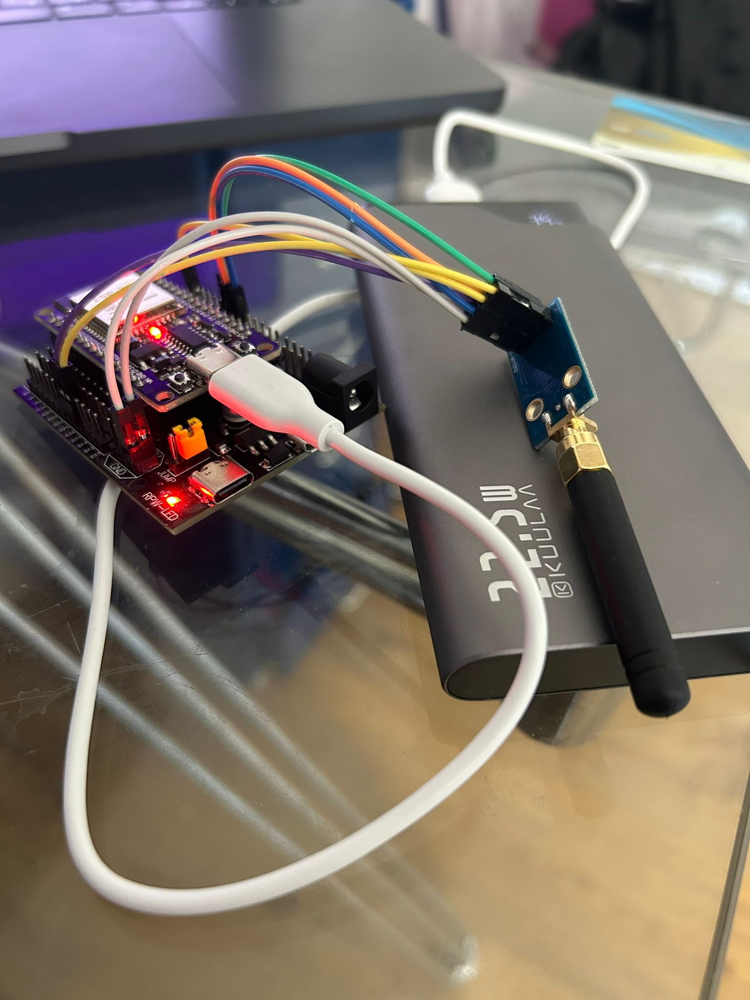
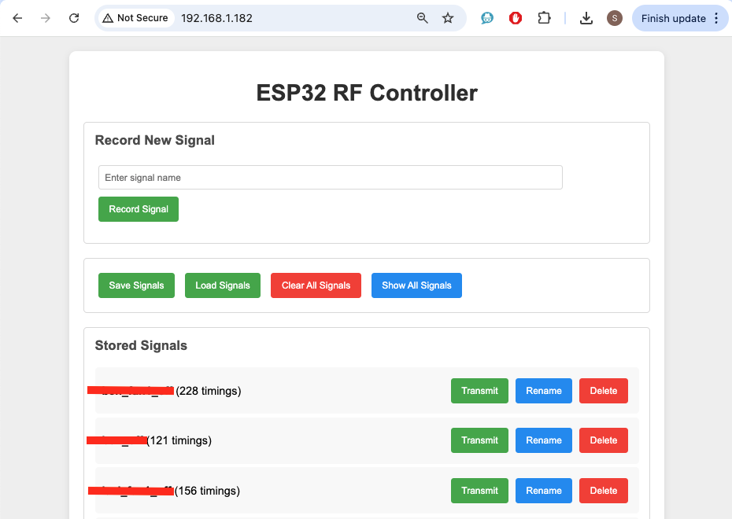
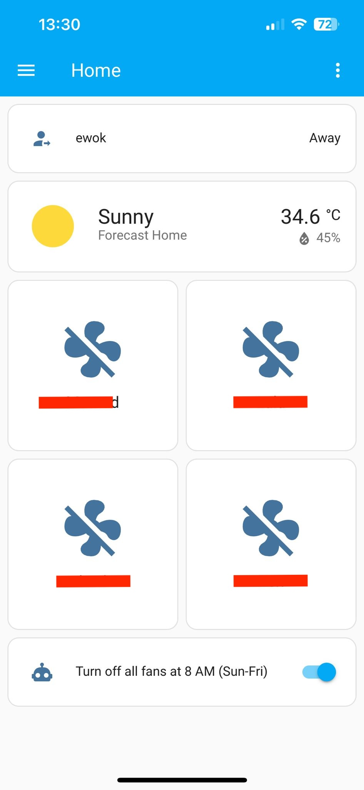

# esp32-cc1101-rf-caprep
ESP32 + CC1101 RF signal capture and replay tool. Record, analyze, and retransmit radio frequency signals using the ESP32 microcontroller paired with a CC1101 sub-GHz transceiver module.

<p style="text-align: center;">
    
</p>

## Features

- 📡 Record RF signals with names
- 🔊 Transmit recorded signals
- 💾 Save/Load signals to/from flash memory
- 🌐 Web-based user interface
- 📝 Rename stored signals
- 🗑️ Delete individual signals or clear all
- 📊 View detailed signal data
- 🔄 Auto-save on changes
- 📱 Mobile-friendly responsive design

## Hardware Requirements

- ESP32 development board
- CC1101 RF module
- Appropriate antenna for 433.92 MHz

## Pin Configuration

```
ESP32 Pin  ->  CC1101 Pin
18 (SCK)   ->  SCK
19 (MISO)  ->  MISO
23 (MOSI)  ->  MOSI
5  (CS)    ->  CSN
25         ->  TX (GDO0)
26         ->  RX (GDO2)
```

## Dependencies

### Required Libraries

1. [CC1101-ESP-Arduino](https://github.com/wladimir-computin/CC1101-ESP-Arduino) - Core RF communication library
   - **Important**: This library must be downloaded and installed manually from the GitHub repository
2. ArduinoJson - For JSON handling
3. SPIFFS - For file system operations
4. ESP32 core libraries (WiFi, WebServer, ESPmDNS)

### Installation

1. Install the Arduino IDE
2. Add ESP32 board support to Arduino IDE
3. Install the required libraries:
   - Clone or download the [CC1101-ESP-Arduino](https://github.com/wladimir-computin/CC1101-ESP-Arduino) library and install it in your Arduino libraries folder
   - Install ArduinoJson through the Arduino Library Manager

## Setup and Configuration

1. Open `server.ino` in Arduino IDE
2. Update the WiFi credentials:
   ```cpp
   const char* ssid = "YOUR_SSID";     // Change this
   const char* password = "YOUR_PASSWORD"; // Change this
   ```
3. Upload the code to your ESP32

## Usage

1. Power up the ESP32
2. Connect to the WiFi network
3. Access the web interface at `http://esp32-rf.local` or the IP address shown in the Serial Monitor
4. Use the web interface to:
   - Record new RF signals
   - Transmit recorded signals
   - Manage stored signals
   - Save/Load signals to/from flash memory

## Web Interface Features

<p style="text-align: center;">
    
</p>

- Record new signals with custom names
- List all stored signals
- Transmit stored signals
- Rename signals
- Delete individual signals
- Clear all signals
- Save/Load signals to/from flash memory
- View detailed signal data

## Homeassistant integration
esp32-rf exposes a REST API you can call and allows you to re-transmit signals on demand.
See [Homeassistant configuration example](/homeassistant.yaml) for reference.

<p style="text-align: center;">
    
</p>

## Technical Details

- RF Frequency: 433.92 MHz
- Data Rate: 2.4 kbps
- Modulation: ASK/OOK
- TX Power: +10 dBm
- RX Bandwidth: 162 kHz
- Signal storage: SPIFFS filesystem
- Maximum signal changes: 512 timings

## Troubleshooting

1. If the web interface shows "No signals stored":
   - This is normal for first use
   - Try recording a signal first
   - Check if SPIFFS is properly initialized

2. If WiFi connection fails:
   - Check your WiFi credentials
   - The device will halt if unable to connect within 30 seconds

3. If CC1101 initialization fails:
   - Check your wiring
   - Verify the CC1101 module is properly powered
   - Ensure proper SPI connections

## License

This project is open-source. Feel free to modify and distribute as needed.

## Contributing

Contributions are welcome! Please feel free to submit pull requests or create issues for bugs and feature requests.
