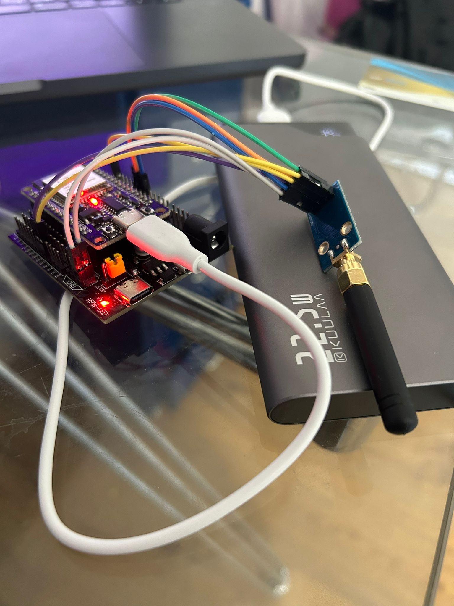
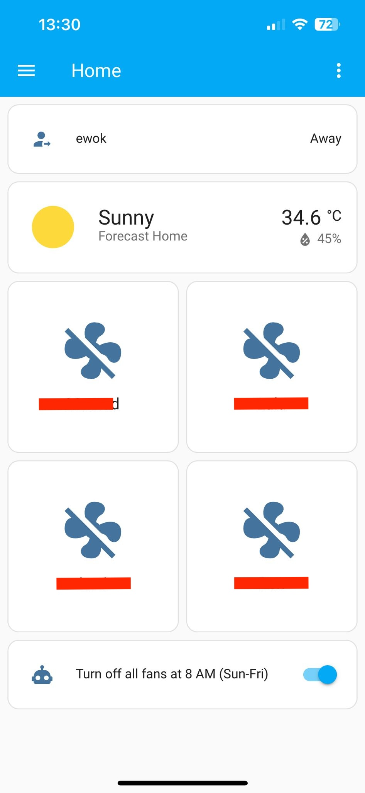

# esp32-cc1101-rf-caprep
ESP32 + CC1101 RF signal capture and replay tool. Record, analyze, and retransmit radio frequency signals using the ESP32 microcontroller paired with a CC1101 sub-GHz transceiver module.

<p style="text-align: center;">
    
</p>

## Update

The project has been rebuilt on **ESPHome**, replacing the standalone Arduino sketch. The new version decodes the fan RF protocol (29-bit OOK messages) and sends targeted commands instead of blindly replaying captured timings. Works specifically on 'Pacific' ceiling fans, but might work on other controllers as well. This gives native Home Assistant integration via the ESPHome API, OTA updates, a built-in web UI, and a captive portal fallback — with no REST glue needed.

The original Arduino capture/replay tool (`server.ino`) is still included for general-purpose RF signal recording and analysis.

## Features

### ESPHome Fan Controller (`esphome/`)
- Decoded 433.92 MHz OOK protocol: 20-bit device address + 9-bit command + parity
- Per-fan speed control (6 speeds), on/off toggle, light, and direction inversion
- Native Home Assistant integration via ESPHome API (no REST commands required)
- Built-in web server for local control
- RF signal recorder with automatic protocol decoding
- Raw command sender for protocol exploration
- Captive portal fallback when WiFi is unavailable
- OTA firmware updates

### Legacy Arduino Sketch (`server.ino`)
- Generic RF signal capture and replay
- Web-based UI with signal management (record, transmit, rename, delete)
- SPIFFS signal persistence with JSON serialization
- Backup import/export (text dump format)
- REST API for Home Assistant integration
- mDNS discovery (`esp32-rf.local`)

## Hardware Requirements

- ESP32 development board
- CC1101 RF transceiver module
- Appropriate antenna for 433.92 MHz

## Pin Configuration

```
ESP32 Pin  ->  CC1101 Pin
18 (SCK)   ->  SCK
19 (MISO)  ->  MISO
23 (MOSI)  ->  MOSI
5  (CS)    ->  CSN
25         ->  GDO0 (TX data)
26         ->  GDO2 (RX data)
```

## ESPHome Setup (Recommended)

### Prerequisites

- [ESPHome](https://esphome.io/) installed (`pip install esphome`)

### Installation

1. Edit `esphome/esphome_fan_controller.yaml` and set your WiFi credentials:
   ```yaml
   wifi:
     ssid: "YOUR_SSID"
     password: "YOUR_PASSWORD"
   ```
2. If using Home Assistant encryption, update the API key or remove the `encryption` block.
3. Flash the ESP32:
   ```bash
   cd esphome
   esphome run esphome_fan_controller.yaml
   ```
4. The device will appear automatically in Home Assistant if you have the ESPHome integration.

### Adding a New Fan

1. Use the "Record RF Signal" button (web UI or HA) to capture a signal from the fan's remote.
2. Check the ESPHome logs for the decoded address:
   ```
   [cc1101] === DECODED FRAME ===
   [cc1101]   Address (20b): 0xABCDE
   [cc1101]   Command (9b) : 0x1E8
   ```
3. Copy an existing fan block in `esphome_fan_controller.yaml`, update the name, id, and address.
4. Re-flash with `esphome run`.

### Known Device Addresses

| Fan   | Address   |
|-------|-----------|
| Ben   | `0x1AC12` |
| Lavi  | `0xB9815` |
| Lulu  | `0x6C595` |
| Mamad | `0x034EB` |

### RF Protocol Details

Each message is a 30-bit OOK frame: 20-bit device address + 9-bit command + 1 even-parity bit.

| Command   | Code      | Binary      |
|-----------|-----------|-------------|
| Speed 1   | `0x1E8`   | `111101000` |
| Speed 2   | `0x1C8`   | `111001000` |
| Speed 3   | `0x1A9`   | `110101001` |
| Speed 4   | `0x189`   | `110001001` |
| Speed 5   | `0x16A`   | `101101010` |
| Speed 6   | `0x14A`   | `101001010` |
| Toggle    | `0x191`   | `110010001` |
| Light     | `0x0B5`   | `010110101` |
| Invert    | `0x12B`   | `100101011` |

OOK timing: ~370 us (short/0), ~1100 us (long/1), ~6000 us inter-frame gap, 12 preamble pulses, 12 repetitions per transmission.

## Legacy Arduino Setup

### Dependencies

1. [CC1101-ESP-Arduino](https://github.com/wladimir-computin/CC1101-ESP-Arduino) — must be installed manually
2. ArduinoJson
3. SPIFFS
4. ESP32 core libraries (WiFi, WebServer, ESPmDNS)

### Installation

1. Install the Arduino IDE and add ESP32 board support
2. Install the required libraries:
   - Clone or download the [CC1101-ESP-Arduino](https://github.com/wladimir-computin/CC1101-ESP-Arduino) library into your Arduino libraries folder
   - Install ArduinoJson through the Arduino Library Manager
3. Open `server.ino`, update WiFi credentials, and upload to ESP32
4. Access the web interface at `http://esp32-rf.local`

### Home Assistant Integration (Legacy)

The legacy Arduino sketch exposes a REST API for signal replay. See [homeassistant.yaml](/homeassistant.yaml) for an example configuration.

<p style="text-align: center;">
    
</p>

## Technical Details

- RF Frequency: 433.92 MHz
- Data Rate: 2.4 kbps
- Modulation: ASK/OOK
- TX Power: +10 dBm
- RX Bandwidth: 162 kHz
- Maximum captured transitions: 512

## Troubleshooting

1. **CC1101 not detected** — check SPI wiring. The ESPHome logs will show `CC1101 not detected (ver=0x00)` if communication fails.
2. **No signal captured** — ensure the remote is within range and operating at 433.92 MHz. The recorder has a 10-second timeout.
3. **WiFi connection fails** — verify credentials. The ESPHome build falls back to a captive portal AP (`Fan-Controller-AP` / `fan12345678`). The Arduino build halts after 30 seconds.
4. **Fan doesn't respond** — confirm the correct device address. Use the recorder to capture and decode a fresh signal from the remote.

## License

This project is open-source. Feel free to modify and distribute as needed.

## Contributing

Contributions are welcome! Please feel free to submit pull requests or create issues for bugs and feature requests.
